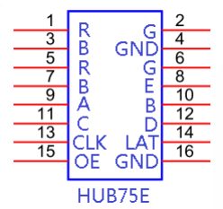
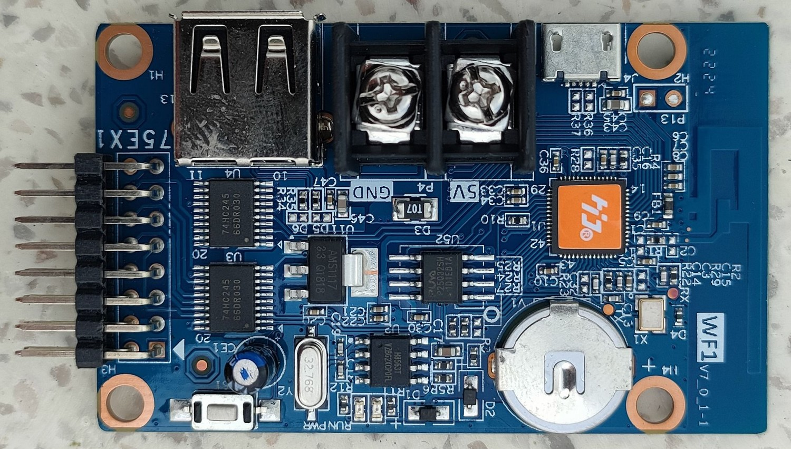

# 128x64
Projects for LED and OLED displays with this resolution

Just ordered a few 1.14" OLED displays with SH1106 or SSD1305 controller. And have seen that there are some 128x64 2.5mm LED displays with RH75 connector available. Same resolution - let's use it for some Circuitpython and Arduino C projects and the Raspberry Pico or some ESP32-S3 boards.

__Connect via HUB75E__

## Providers p5 64x32 320mmx160mm

- P5/11-2000
- IUX516B-1M011
- 2P1111E-1749
- P5-XGY(29P)-HY820
- HK-P5-5-1
- LI500P5
- ALRP51000
- PAN1500P5
- 2014-01-06
- PAN720
- P5-16S-M1266A
- 16S-V1.0
- ALan450
- PAN1100

## Example 64x64 p4 256mmx256mm

- Model:P4-256*128-2121-A1 MTS China
- Pixel pitch: 4mm
- Module resolution: 64 x 64 pixels
- Module size: 256mm x 256mm
- Net weight:~0.2kg
- IC: DP5020B
- LED bulb type: SMD2121 (3IN1:1R1G1B)
- Scan type: 1/16s
- Communication: HUB75
- Average capacity: 400W/m²
- Working voltage: 4.6 – 5.2VDC
- Connectable cards: linsn, q1pro, nova, kystar, huidu, i5a…..
- Control software: Ledstudio 12.65, LedMplayer, nova studio, kystar-v20.01, HD player, ledvision 3.5….
- High definition P4 led screen with pixel density of 62,500 pixels/square meter

Source: https://www.lazada.vn/products/module-led-p4-full-color-trong-nha-module-p4-fullcolor-indoor-256mm-x-256mm-day-du-phu-kien-hang-cu-sky795-i1306696033-s5059578568.html

## Controller HD-WF1 V7_0_1-1

Parameter:

– Full color: height 32*384
– Seven colors: 32 * 768
– Supports many languages, Vietnamese, English
– Soft supports IOS, Android,
– Communication method: WIFI
– Working voltage: + 4.5V ~ 6V
– Maximum power consumption: <1W
– Working temperature: -30 ° C ~ 70 ° C

– Supports various indoor and outdoor unit boards: HUB75E interface board with different specifications.
– Support for special chips: such as ICN2038S.
– Specialized for full-color matrix LEDs

Source: https://www.lazada.vn/products/card-module-led-wf1-dieu-khien-led-full-mau-full-color-qua-usbwifi-dieu-khien-dien-thoai-i2182304176-s10346446386.html

### [HUIDU Technology](https://www.huidu.cn/en)

- Software downloads https://www.huidu.cn/download/128.html
- Youtube Video about this board https://www.youtube.com/watch?v=MJS8p_YfVYk 
- Controller https://datasheetspdf.com/datasheet/ICN2038.html 
- HD2020 the software to update all the single color control boards like WF1 https://cdn1.huidu.cn/huidu.cn/hd2020%20v1.3.2.1.exe
